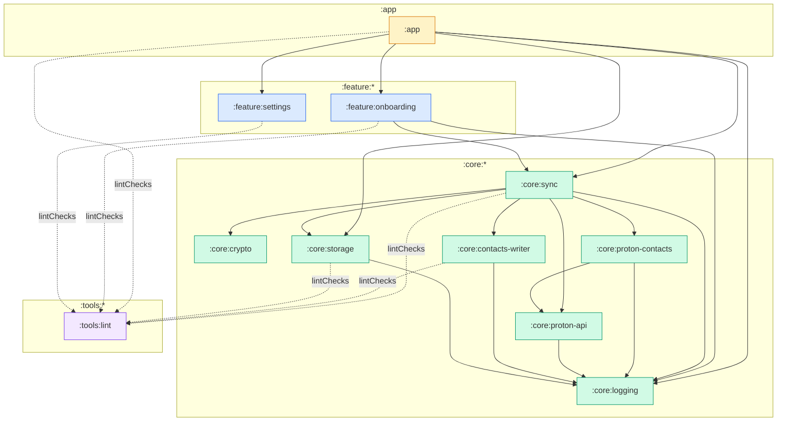

<!--
SPDX-License-Identifier: GPL-3.0-only
SPDX-FileCopyrightText: 2026 pcontacts contributors
-->

# Module-dependency architecture

pcontacts is a multi-module Android project. `:core:sync` is the integration
layer that bridges Proton API access and cryptography with the Android
contacts stack. Feature modules reach those subsystems only through
`:core:sync`, never directly (ADR-0011). No module depends on `:app`.

**Legend**

- Solid arrows = `implementation` or `api` project dependencies (runtime).
- Dashed arrows = `lintChecks` (build-time only).
- **ADR-0011 boundary:** `:feature:*` modules must not depend on `:core:crypto`
  or `:core:proton-api` directly. They reach those layers exclusively through
  `:core:sync`.
- **ADR-0015 boundary:** no module may introduce Google Play Services,
  Firebase, analytics, or telemetry dependencies. The `:app:checkLicense` task
  enforces this at build time.
- `:core:crypto`, `:core:proton-api`, `:core:proton-contacts`, and
  `:core:logging` are **pure-JVM** modules (testable without an emulator).
- `:tools:lint` is consumed via `lintChecks` by every Android module; it
  enforces the `pcontacts.SensitiveLog` rule (ADR-0015).
