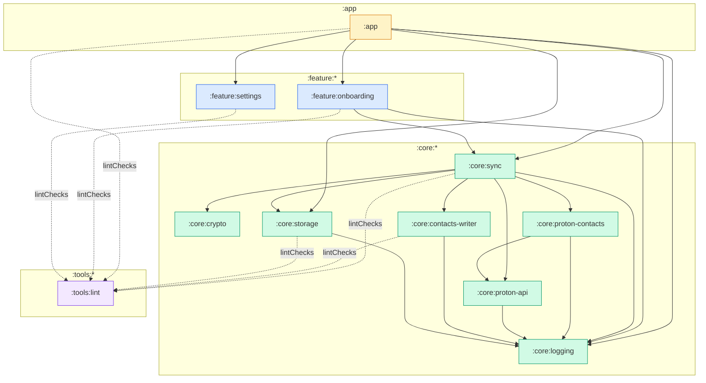

<!--
SPDX-License-Identifier: GPL-3.0-only
SPDX-FileCopyrightText: 2026 pcontacts contributors
-->

# Module-dependency architecture

pcontacts is a multi-module Android project. `:core:sync` is the integration
layer that bridges Proton API access and cryptography with the Android
contacts stack. Feature modules reach those subsystems only through
`:core:sync`, never directly (ADR-0011). No module depends on `:app`.

```mermaid
graph TD
    subgraph app["  :app  "]
        APP[":app"]
    end

    subgraph features["  :feature:*  "]
        ONBOARDING[":feature:onboarding"]
        SETTINGS[":feature:settings"]
    end

    subgraph core["  :core:*  "]
        SYNC[":core:sync"]
        CRYPTO[":core:crypto"]
        PROTON_API[":core:proton-api"]
        PROTON_CONTACTS[":core:proton-contacts"]
        CONTACTS_WRITER[":core:contacts-writer"]
        STORAGE[":core:storage"]
        LOGGING[":core:logging"]
    end

    subgraph tools["  :tools:*  "]
        LINT[":tools:lint"]
    end

    %% :app dependencies
    APP --> SYNC
    APP --> STORAGE
    APP --> LOGGING
    APP --> ONBOARDING
    APP --> SETTINGS

    %% :feature:onboarding dependencies
    ONBOARDING --> SYNC
    ONBOARDING --> LOGGING

    %% :core:sync dependencies (the integration hub)
    SYNC --> PROTON_API
    SYNC --> CRYPTO
    SYNC --> STORAGE
    SYNC --> LOGGING
    SYNC --> CONTACTS_WRITER
    SYNC --> PROTON_CONTACTS

    %% :core:proton-contacts dependencies
    PROTON_CONTACTS --> PROTON_API
    PROTON_CONTACTS --> LOGGING

    %% :core:proton-api dependencies
    PROTON_API --> LOGGING

    %% :core:contacts-writer dependencies
    CONTACTS_WRITER --> LOGGING

    %% :core:storage dependencies
    STORAGE --> LOGGING

    %% lintChecks (dashed = build-time only)
    APP -.->|lintChecks| LINT
    ONBOARDING -.->|lintChecks| LINT
    SETTINGS -.->|lintChecks| LINT
    SYNC -.->|lintChecks| LINT
    CONTACTS_WRITER -.->|lintChecks| LINT
    STORAGE -.->|lintChecks| LINT

    %% Styling
    classDef boundary fill:none,stroke:#e74c3c,stroke-width:2px,stroke-dasharray:5 5
    classDef featureMod fill:#dbeafe,stroke:#2563eb
    classDef coreMod fill:#d1fae5,stroke:#059669
    classDef appMod fill:#fef3c7,stroke:#d97706
    classDef toolMod fill:#f3e8ff,stroke:#7c3aed

    class APP appMod
    class ONBOARDING,SETTINGS featureMod
    class SYNC,CRYPTO,PROTON_API,PROTON_CONTACTS,CONTACTS_WRITER,STORAGE,LOGGING coreMod
    class LINT toolMod
```

**Legend**

- Solid arrows = `implementation` or `api` project dependencies (runtime).
- Dashed arrows = `lintChecks` (build-time only).
- **ADR-0011 boundary:** `:feature:*` modules must not depend on `:core:crypto`
  or `:core:proton-api` directly. They reach those layers exclusively through
  `:core:sync`.
- **ADR-0015 boundary:** no module may introduce Google Play Services,
  Firebase, analytics, or telemetry dependencies. The `:app:checkLicense` task
  enforces this at build time.
- `:core:crypto`, `:core:proton-api`, `:core:proton-contacts`, and
  `:core:logging` are **pure-JVM** modules (testable without an emulator).
- `:tools:lint` is consumed via `lintChecks` by every Android module; it
  enforces the `pcontacts.SensitiveLog` rule (ADR-0015).

## Key decisions

The load-bearing calls; [`docs/adr/README.md`](adr/README.md) indexes every ADR.

- **Native Kotlin crypto** in `:core:crypto`: BouncyCastle for OpenPGP, ported Proton SRP (go-srp variant) + bcrypt-SHA-512. No embedded JS engine. (ADR 0002)
- **F-Droid first**, sideload-friendly. No Google Play Services, no telemetry, no closed-source binaries. Enforced by a `checkForbiddenDependencies` Gradle task that fails CI on any forbidden group landing in a release classpath. (ADRs 0003, 0015)
- **The dependency audit ships in the app.** A "Dependencies" chip next to the version opens a screen listing every shipped artifact with version, license and known advisories linked to osv.dev. The list is a snapshot generated at build time from one osv.dev query and committed to the repo; CI fails when it no longer matches the resolved classpath or when osv.dev or the weekly Dependency-Check scan reports an open advisory it does not list. (ADR 0024)
- **Optional runtime check, off by default.** A switch in Privacy sends the same artifact list (public in this repo) once a day to osv.dev, which then sees the device's address and can infer the app from the artifacts asked; the switch says so and calls it a privacy-versus-security trade-off left to the user. Only while it is on does the chip carry a verdict ("Dependencies OK"; assessed, amber; vulnerability, red), from osv.dev alone; new advisories are announced once and can be muted, which counts as assessed until the artifact changes version. Nothing else in the app depends on the answer. (ADR 0025)
- **`AbstractAccountAuthenticator` + `SyncAdapter`** for system integration; `WorkManager` as the belt-and-suspenders periodic scheduler. (ADR 0004)
- **Client-side decrypt only.** The app never calls the server-side decrypting export endpoint; a CI grep fails on its path. (ADR 0007)
- **Bidirectional sync** with persistent outbox, per-field three-way merge, soft-delete with 1-hour grace, and push-before-pull ordering. Supersedes the read-only MVP scope. (ADRs 0017, 0018; supersedes ADR 0006)
- **Delete-and-reinsert child Data rows on update**, never the parent RawContact (preserves user-owned aggregate state — starred, custom ringtone, custom photo). (ADR 0010)
- **Modulus signature verification** against a pinned Proton SRP signing key. Verified against live API. (ADR 0014)
